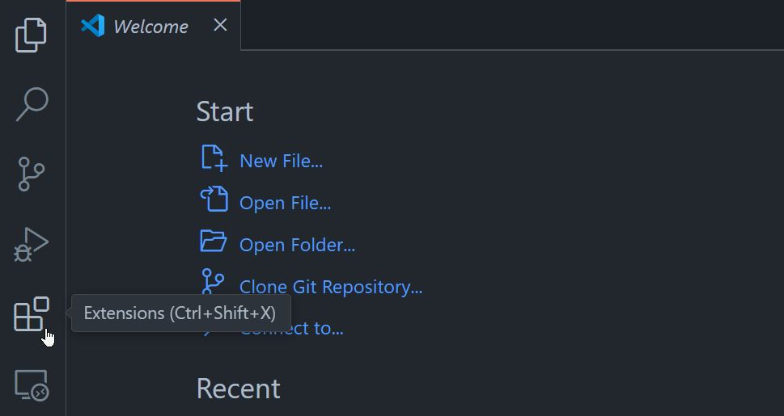
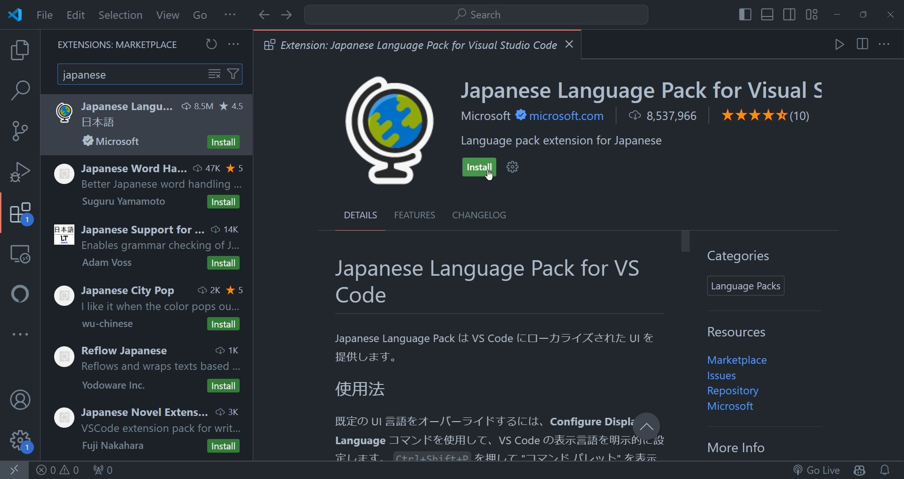
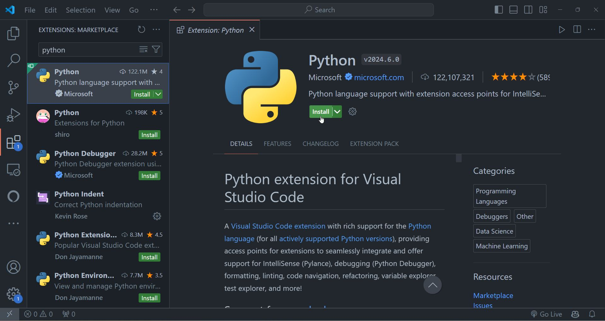
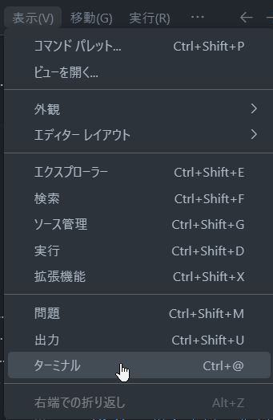
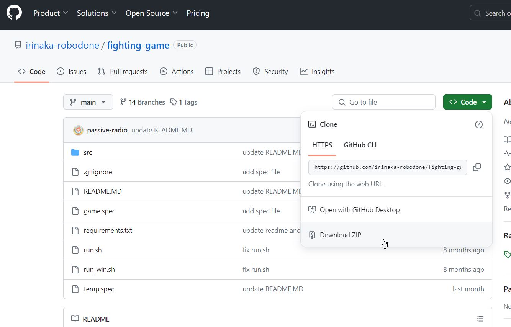
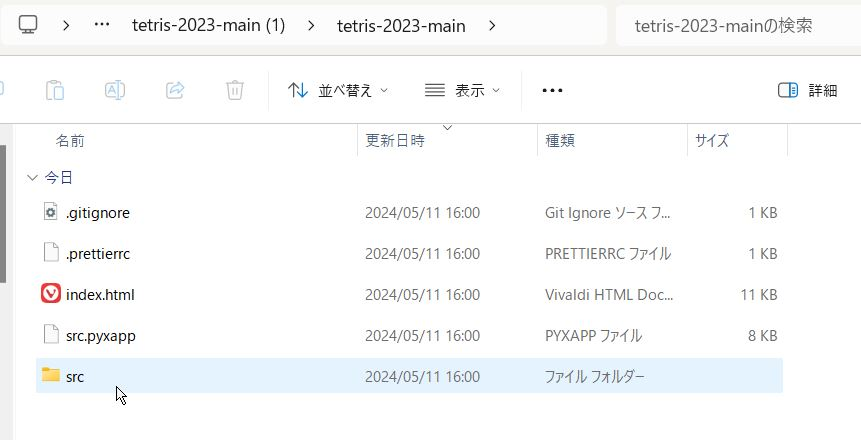
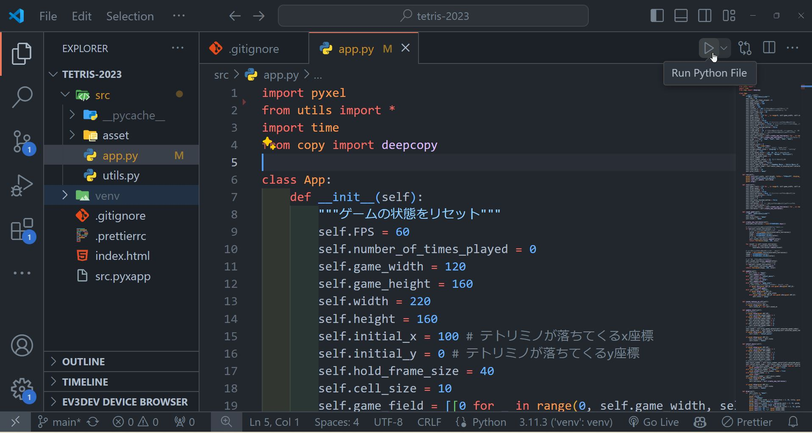

Pyxel で作ったゲームアプリを HTML に変換するのは簡単です！

以下の見出しの順に進めていけば、Pyxel で作ったゲームアプリを HTML に変換して、ブラウザから遊べるようにすることができます。

## Python 実行環境を整える

まずは手元の PC で Python が実行できる環境を整えましょう。

行うことは次の２つです。
1. Python をインストールする
1. 開発環境 (VSCode) を整える

すでに、Python がインストールされていて、開発環境が整っている場合は次のセクションに進んでください。

### Python をインストールする

Python がインストールされていない場合は、[Python の公式サイト](https://www.python.org/) からインストーラーをダウンロードしてインストールしてください。

以下のサイトでは OS 別の Python のインストール方法、実行環境の整え方が解説されています。参考にしてください。

- [Python のインストール方法](https://www.python.jp/install/install.html)

### 開発環境 (VSCode) を整える

開発環境とは、プログラムを書いたりデバッグしたり実行するのに使うエディターなどのことを指します。ロボ団いりなか校でも使う Visual Studio Code (VSCode) のインストールをおすすめします。

VSCode がインストールされていない場合は、**[VSCode の公式サイト](https://code.visualstudio.com/)** からインストーラーをダウンロードしてインストールしてください。

VSCode のインストールが完了したら、VSCode を起動しましょう。このままでも開発はできますが、日本語化や Python の開発環境を整えるための拡張機能をインストールすると便利です。
VSCode が起動したら、左側のアイコンから **Extensions** を選択して、まずは VSCode の日本語化を行いましょう。



Extensions 画面が開いたら、検索バーに `japanese` と入力して、**Japanese Language Pack for Visual Studio Code** をインストールしてください。これは Microsoft が提供している日本語化の拡張機能です。



インストールが完了したら、VSCode を再起動すると日本語化が完了します。

次に Python の開発環境を整えましょう。Extensions 画面を開いて、検索バーに `python` と入力して **Python** をインストールしてください。これは Python の開発環境を整えるための拡張機能です。



ここまでで VSCode を使った最低限の Python の開発環境を整えることができました。

ここからはお好みになりますが、さらに開発体験を向上させるためにロボ団いりなか校で使っている拡張機能を紹介します。適宜インストールしてください。

ロボ団いりなか校が開発環境で使っている Python 向けの拡張機能は以下の通りです。

- **Indent Rainbow** - インデントの深さを色分けして表示する拡張機能
- **Python Indent** - Python のインデントを自動で調整する拡張機能
- **Material Icon Theme** - VSCode 上でファイルの種類をわかりやすくするアイコンテーマ
- **Rainbow CSV** - CSV ファイルの列を色分けして表示する拡張機能

以上で Python の実行環境を整えることができました。

## Pyxel をインストールする

**Pyxel** をインストールします。
Pyxel とはロボ団いりなか校で卒業制作の開発にも使った Python でゲームを開発するための比較的新しめのライブラリで、作ったゲームを HTML に変換できるのも特徴です。

以下のコマンドをターミナル（端末）で実行して Pyxel をインストールしてください。

```bash
pip install -U pyxel
```

VSCode からもターミナルを開くことができます。VSCode を起動して、メニューから **画面(View)** > **ターミナル(Terminal)** を選択するとターミナルが開きます。



VSCode 内のターミナルからでも上記のコマンドを実行するｋとで Pyxel をインストールできます。

pip not found と表示される場合は、Python のインストール時に pip をインストールするオプションを選択していない可能性があります。その場合は Python がインストールされていないか、Python のパスが通っていない可能性があります。

以下のサイトを参考に Python のインストール方法、パスの通し方を確認してください。

- [Python のインストール方法](https://www.python.jp/install/install.html)

## Pyxel でつくられたゲームを用意する

Python の実行環境と Pyxel のインストールが完了したら、Pyxel でゲームを作りましょう。
ただしゼロからつくる必要はありません。ここではゲームを HTML 化する方法を紹介するので、ロボ団いりなか校でこれまでに制作したゲームのソースコードを使います。制作したほとんどのゲームのソースコードは [ロボ団いりなか校のリポジトリ一覧 | GitHub](https://github.com/irinaka-robodone?tab=repositories) に公開しているので、１つを選んでダウンロードしてください。

ただし Pyxel で開発していないリポジトリも含まれるので以下のリポジトリから選ぶとよいです。

- [tetris-2023](https://github.com/irinaka-robodone/tetris-2023)
- [othello-2023](https://github.com/irinaka-robodone/othello-2023)
- [snake-game-2023](https://github.com/irinaka-robodone/snake-game-2023)
- [puzzle-2023](https://github.com/irinaka-robodone/puzzle-2023)
- [typing-game-2023](https://github.com/irinaka-robodone/typing-game-2023)
- [block-kuzushi-2023](https://github.com/irinaka-robodone/block-kuzushi-2023)
- [air-hockey-2023](https://github.com/irinaka-robodone/air-hocky-2023)

GitHub リポジトリをダウンロードするには、リポジトリのトップページにある **Code** ボタンをクリックして **Download ZIP** を選択してください。ソースコードが Zip 形式で圧縮されたものがダウンロードされます。



ダウンロードした Zip ファイルを解凍すると、ゲームのソースコードが含まれているフォルダができます。このフォルダを VSCode で開いてください。



VSCode がインストールされていない場合は、**[VSCode の公式サイト](https://code.visualstudio.com/)** からインストーラーをダウンロードしてインストールしてください。

## Pyxel でゲームが動くか確認する

入手したソースコードが入ったフォルダーを VSCode で開けたら、ゲームが動くか確認しましょう。

VSCode 上で以下のように `src/app.py` か `src/main.py`, `src/game.py` を見つてください。これがゲームを動かすメインのスクリプトファイルです。



画像のようにエディター画面で `src/app.py` を開いたら、右上の再生ボタンをクリックしてください。ゲームが起動すれば、Pyxel で作ったゲームが動くことが確認できます。

再生ボタンを押しても何も起こらず、スクリプトのエラーでもない場合は Python, Pyxel のインストールがうまくいっていない可能性があります。

それでもうまくいかない場合は、ターミナルから直接スクリプトを実行してみてください。VSCode のターミナルを開いて、以下のコマンドを実行してください。

アプリのスクリプトファイルが `src/app.py` の場合は以下のコマンドになります。

```bash
python src/app.py
```

`src/game.py` の場合
```bash
python src/game.py
```

`src/main.py` の場合
```bash
python src/main.py
```

ゲーム、アプリが動くことを確認できれば、次のステップに進みます。

## Pyxel で作ったゲームアプリを HTML に変換する

HTML とは、Web ページを作るための言語の一つです。Pyxel で作ったゲームアプリを HTML に変換することで、ブラウザから遊べるようになります。

Python で書かれたアプリを HTML に変換するためには、`pyxel` コマンドを使います。

```bash
pyxel package {アプリのソースコードがあるフォルダーのパス} {アプリを起動するためのスクリプトファイルのパス}
```

これまでのステップの続きであれば、アプリのソースコードは
`src` フォルダーに、アプリを起動するためのスクリプトファイルは `src/app.py` か `src/game.py`、 `src/main.py` にあるはずです。

その場合は以下のコマンドを実行することで、Pyxel を使って書いたスクリプトを１つの `pyxapp` ファイルにまとめます。

```bash
pyxel package src src/app.py
```

コマンドを実行すると、`src.pyxapp` ファイルが生成されます。次に以下のようにコマンドを実行してこのファイルを HTML に変換します。

```bash
pyxel app2html src.pyxapp
```

